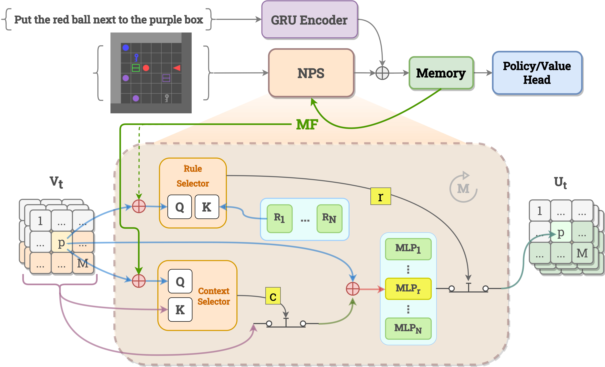

# Instruction Conditioned MOdular network (ICMO)
This repository contains the code for ICMO, a language-informed reinforcement learning agent trained on the BabyAI environment.





## Installation
Our code was tested with Python 3.7, 3.8, and 3.9. You can follow these instructions to set up the project. We recommend installing the dependencies via a Conda environment as below.

```
conda create --name ICMO python=3.8
conda install pytorch==1.7.0 torchvision==0.8.0 torchaudio==0.7.0 cudatoolkit=11.0 -c pytorch
git clone https://github.com/nhashemi202/ICMO.git
cd ICMO
pip install -r requirements.txt
```

## Training
Run the following command from the `core/run` folder to start training ICMO. In this example command, we train ICMO on the `PickupLoc` task. The results are stored under `core/run/logs` folder.
```
python3 ../scripts/train_rl.py --env BabyAI-PickupLoc-v0 \
--test_env BabyAI-PickupLoc-v0 \
--seed=42 \
--frames=300000000 \
--instr_to_rule_mode='linear' --instr_arch='gru' --num_rules=8 --rule_codebook_size=16 \
--instr_dim=64 --rule_dim=64 \
--num_contexts=1 --act_dim=1 --compositional_step=1 \
--memory_dim 1024 \
--model "ABLATION_NPS" --arch='NPS_vanilla' \
--procs=16 --batch_size=1280 --frames_per_proc=80 --recurrence=20 --rim_slowness_factor=4 \
--save_interval=500 \
--use_all_slots \
--use_compositional_split \
--no_instr \
--input_mem_concat_instr \
--use_hidden_feedback_contextual
```

## Acknowledgements
- Neural Production Systems ([Code](https://github.com/anirudh9119/neural_production_systems)/[Paper](https://arxiv.org/abs/2103.01937))

- BabyAI environment ([Code](https://github.com/mila-iqia/babyai)/[Paper](https://openreview.net/pdf?id=rJeXCo0cYX))
